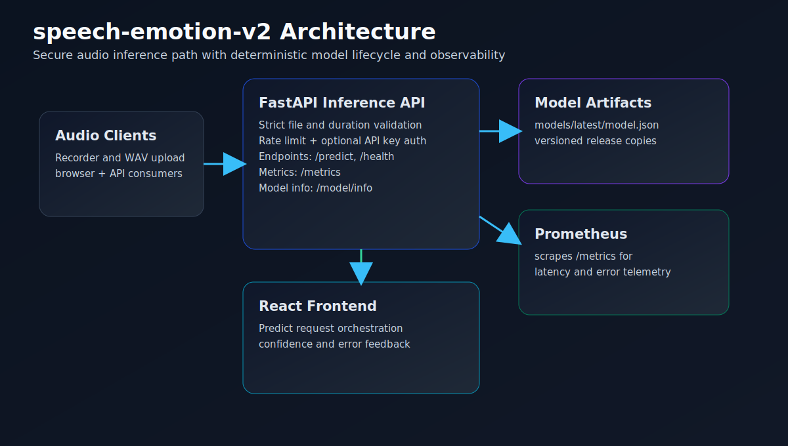
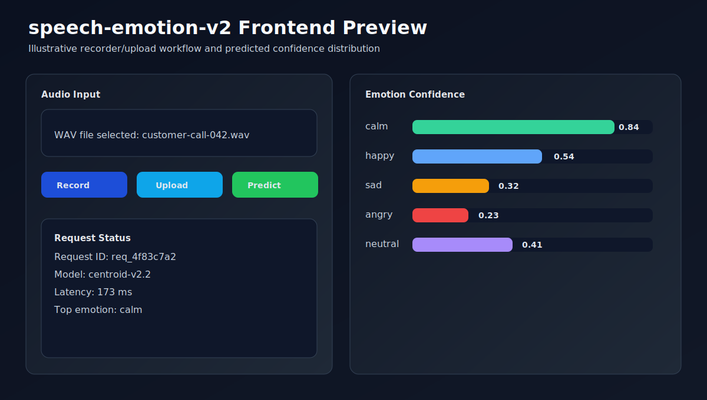

<!-- Generated by GitHub Copilot -->
# speech-emotion-v2

Production-ready speech emotion inference platform with recorder/upload frontend, secured FastAPI backend, deterministic training pipeline, and model lifecycle controls.


## Implemented Scope

1. Frontend recorder and WAV upload flows with confidence and failure messaging.
2. Backend API with strict file validation, duration constraints, request IDs, security headers, rate limiting, and Prometheus metrics.
3. Deterministic model artifact lifecycle with trainable centroid model and versioned JSON artifact.
4. Optional MLflow tracking for training metrics and artifact logging.
5. Integration tests and CI for backend and frontend build integrity.
6. Governance baseline: contributing, security, architecture, API, deployment, testing, changelog, model card, templates, and code ownership.

## Repository Layout

1. `api/main.py` - inference API service and operational middleware.
2. `src/infer.py` - WAV decoding, feature extraction, and inference scoring.
3. `src/model.py` - model artifact contract and scoring utilities.
4. `src/train.py` - reproducible training pipeline with optional MLflow reporting.
5. `frontend/` - Vite React app for recording, upload, and score visualization.
6. `models/latest/model.json` - active deployed model artifact.
7. `docs/` - architecture, API, deployment, testing, and model governance.

## Quick Start

### Backend

```bash
python -m venv .venv
# Windows PowerShell: .\.venv\Scripts\Activate.ps1
# macOS/Linux: source .venv/bin/activate
pip install -r requirements.txt
uvicorn api.main:app --host 0.0.0.0 --port 8001 --reload
```

Optional backend security env vars:

```bash
SPEECH_API_KEY=
MAX_REQUESTS_PER_MINUTE=120
```

### Frontend

```bash
cd frontend
npm ci
npm run dev -- --host 0.0.0.0 --port 4174
```

## Visual Evidence

Architecture overview:



Frontend prediction flow preview:



## API Endpoints

1. `GET /health` - readiness and model metadata.
2. `GET /model/info` - model version, labels, and feature schema (protected when API key is configured).
3. `POST /predict` - upload WAV audio for emotion prediction (protected when API key is configured).
4. `GET /metrics` - Prometheus metrics.

## Training and Model Lifecycle

### Install training extras

```bash
pip install -r requirements-mlflow.txt
```

### Train and register a model artifact

```bash
python -m src.train --output models/latest/model.json --version v0.2.0 --seed 42 --samples-per-emotion 200
```

### Rollback strategy

1. Keep previous versioned artifacts under `models/releases/`.
2. Promote by replacing `models/latest/model.json` with a known-good release artifact.
3. Validate using `GET /health` and one smoke request to `POST /predict`.

## Quality Gates

```bash
# backend tests
pytest -q

# frontend production build
cd frontend && npm run build
```

## Production Verification

Run before release tag creation:

```bash
# backend
python -m pip install --upgrade pip
pip install -r requirements.txt
python -m compileall -q api src tests
python -m pip check
pytest -q --maxfail=1
pip-audit -r requirements.txt --progress-spinner off

# frontend
cd frontend
npm ci
npm run build
npm audit --omit=dev --audit-level=high
```

Expected outcome:

1. Backend compile, dependency consistency, and tests pass.
2. Frontend production build completes.
3. No high-severity dependency vulnerabilities remain.

## Security and Accessibility Highlights

1. Input validation for extension, MIME type, file size, and duration.
2. Security headers and request IDs on all backend responses.
3. Rate limiting to reduce abuse and accidental resource exhaustion.
4. Keyboard-accessible UI controls and live status updates for screen readers.

## Production Documentation

1. `docs/ARCHITECTURE.md`
2. `docs/API.md`
3. `docs/DEPLOYMENT.md`
4. `docs/TESTING.md`
5. `docs/MODEL_CARD.md`
6. `SECURITY.md`
7. `CONTRIBUTING.md`
8. `CHANGELOG.md`
9. `.claude/CLAUDE.md`
10. `.github/workflows/release.yml`

## Service Endpoints (local)

1. API: http://127.0.0.1:8001
2. Frontend: http://127.0.0.1:4174

## Limits and Roadmap

Current limits:

1. Inference is file-based and does not yet support streaming audio sessions.
2. Default model artifact contract is JSON-centric and may be suboptimal for large deployments.

Roadmap:

1. Add streaming inference endpoint with bounded session controls.
2. Add model artifact signing and verification for release integrity.
3. Add fairness and drift scorecards in CI artifact reports.

